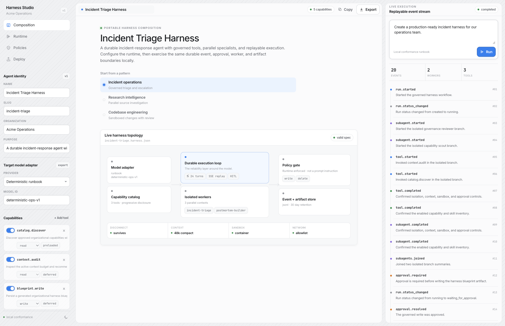

# Dynamic Agent Harness

> Build your own long-running agent harness instead of rebuilding the runtime around every agent.

Dynamic Agent Harness is a professional Next.js starter for organizations that need a **governed, vendor-neutral foundation for durable agents**. It combines a visual composition studio, a persistent local conformance runtime, runtime-enforced approvals, independent parallel branch contexts, context controls, and portable manifests.

The model reasons. The harness keeps the work alive.

**For coding agents:** read [`AGENTS.md`](AGENTS.md) first, then follow the non-interactive example in [`examples/README.md`](examples/README.md).



## What works today

- **Dynamic composition studio:** edit models, tools, skills, runtime limits, context policy, approvals, sandbox policy, and persistence.
- **Real local runbook adapter:** executes only declared capabilities, honors the configured worker limit, pauses before its declared blueprint write, resumes after allow/deny, writes a real artifact, and finishes with an ordered event trace.
- **Persistent JSONL event store:** run records and events persist on disk and replay after a cursor. The browser can disconnect and reconnect without losing persisted observations. Active execution is still process-bound; production restart safety needs a durable job adapter.
- **Runtime approval gates:** write/delete policy is validated in the spec and enforced outside model instructions. A pending approval can be resolved by a replacement runtime instance because its ID is persisted rather than kept only in memory.
- **Portable spec compiler:** emits an organization-owned blueprint plus a guarded TrueForge-compatible AgentSpec shape. Export fails closed when the source network policy cannot be represented by the target schema.
- **Three starting points:** incident operations, research intelligence, and codebase engineering.
- **Agent-first repository:** `AGENTS.md` is the executable contract for Codex, Claude Code, Cursor, OpenCode, and Hermes.

This is a localhost starter, not a hosted control plane. JSONL is intentionally the working single-node adapter and the bundled server has no authentication. Before shared or multi-replica deployment, add authentication and durable jobs, replace the store/subscription ports with Postgres plus Redis/NATS, or connect a compatible exported manifest to [TrueForge](https://github.com/truefoundry/trueforge).

## Quickstart

Requirements: Node.js 22.14 or newer.

```bash
npm install
npm run dev
```

Open [http://127.0.0.1:3110](http://127.0.0.1:3110). Both `npm run dev` and `npm start` bind explicitly to the IPv4 loopback interface; run `npm run build` before `npm start`.

Try the complete path:

1. Choose a template or edit the harness controls.
2. Enter a task in **Live execution**.
3. Select **Run**.
4. Watch the default spec's two independent worker branches complete in parallel.
5. Resolve the runtime approval gate.
6. Inspect the replayable event stream and `.data/artifacts/<run-id>.json`.
7. Export `<slug>.harness.json` from the top bar.

## Why a harness exists

A raw model does not provide a durable loop, tool discovery, context compaction, sandboxing, parallel coordination, approval enforcement, or replay. Those are runtime responsibilities:

```text
Client -> persisted run -> capability discovery -> model/workflow loop
                                      |-> independent worker branches
                                      |-> sandbox + artifacts
                                      |-> runtime approval gate
                                      `-> ordered event stream -> replay
```

For long-running work, reliability moves outside the model. Changing the model, tools, or skills should not require rebuilding session durability, governance, and observability.

## Repository map

```text
app/
  api/runs/                 run, SSE replay, and approval endpoints
  globals.css               Beautiful UI-inspired tokens and interaction system
components/studio/          dynamic builder, topology, event stream, approvals
lib/harness/
  schema.ts                 portable organizational contract and safety validation
  compiler.ts               portable blueprint + TrueForge AgentSpec translation
  store.ts                  JSONL run/event/artifact adapter
  runtime.ts                asynchronous runbook runtime and approval state machine
examples/                   portable example specs
tests/                      schema, compiler, persistence, runtime, and API contracts
docs/                       architecture and adapter boundaries
```

## Portable spec

The browser never asks for or exports credentials. A harness spec contains references and policy only:

```json
{
  "version": 1,
  "name": "Incident Triage Harness",
  "model": { "provider": "runbook", "id": "deterministic-ops-v1" },
  "runtime": {
    "durableSessions": true,
    "subagents": { "enabled": true, "maxParallel": 3 },
    "context": {
      "progressiveDisclosure": true,
      "largeResultOffload": true,
      "compaction": { "enabled": true, "thresholdTokens": 48000 }
    },
    "approvals": { "requiredFor": ["write", "delete"] }
  }
}
```

`lib/harness/compiler.ts` owns both export targets. `toTrueForgeManifest()` follows the current TrueForge wire names (`mcp_servers`, `dynamic_sub_agents`, `context_management`) and deliberately leaves credentials in the target harness's configured stores. TrueForge's inspected sandbox shape has no network-policy field, so the exporter rejects `none` and `allowlist` instead of silently widening them; choose `unrestricted` explicitly only when that is the intended target policy.

## Runtime contract

- Events are append-only and receive monotonically increasing sequence numbers per run.
- SSE consumers can reconnect and replay events after their last sequence.
- Enabled write/delete tools must have a matching runtime approval risk.
- The bundled runbook invokes only enabled tools declared in the spec; unsupported custom mutation tools are exported but never simulated locally.
- The deterministic adapter never claims to be an LLM. It exists to exercise the full runtime without requiring credentials.
- Status events are concise progress summaries, not hidden chain-of-thought.
- Artifacts are only written after an allow decision.
- Denial is a valid terminal path and remains visible in the trace.
- The run record is authoritative for terminal state. The JSONL adapter is single-host persistence, not a transactional distributed workflow engine.

Read [docs/ARCHITECTURE.md](docs/ARCHITECTURE.md) for the full state machine and [docs/ADAPTERS.md](docs/ADAPTERS.md) before connecting a production model, store, queue, sandbox, or policy engine.

## Verification

```bash
npm run verify
```

This runs ESLint, strict TypeScript, Vitest, and a production Next.js build. For the browser path, boot the app and run the flow above; the repository includes no fabricated success data.

## Design and source acknowledgements

- The interface language and selected token ideas are adapted from [Beautiful UI](https://github.com/slev12397/beautiful-ui), MIT, by Shane Levine. Commercial Central Icons, PostHog, Cuelume, and DialKit were intentionally removed.
- The long-running architecture and TrueForge manifest export are grounded in [TrueForge](https://github.com/truefoundry/trueforge), MIT, by TrueFoundry.
- The replaceable capability seams, profile composition, and rule that model-visible state must be logged are adapted from [DeepSeek Harness](https://github.com/deepseek-ai/deepseek-harness), MIT, by DeepSeek. DeepSeek Harness is a fast-moving developer preview; this repository borrows stable architectural ideas rather than its compatibility surface.

See [THIRD_PARTY_NOTICES.md](THIRD_PARTY_NOTICES.md) for notices and exact boundaries.

## License

MIT. See [LICENSE](LICENSE).
